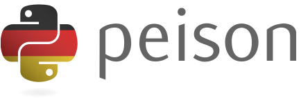

<p align="center">
  
</p>

<p align="center">Die Python Programmiersprache - endlich auf Deutsch!</p>

---

### Was ist Peison?

Peison ist eine Adaption der Python Programmiersprache, auf deutsch. Das Ziel ist es, die Programmiersprache für deutschsprachige Menschen zugänglicher zu machen. Die Syntax ist dabei identisch zu Python, nur die Schlüsselwörter sind auf deutsch.

### Wie kann ich Peison verwenden?

Um eine angelsächsische Python Datei in eine Peison Datei umzuwandeln, kann das Skript `topeison.py` verwendet werden. Dieses Skript kann mit folgendem Befehl ausgeführt werden:

```bash
python topeison.py <input_file>
```

Um ein Peison Skript (Dateiendung `.pei`) auszuführen, kann das Skript `runpeison.py` verwendet werden. Dieses Skript kann mit folgendem Befehl ausgeführt werden:

```bash
python runpeison.py <input_file>
```

Um ein Peison Skript zu regulärem Python zu konvertieren, kann das Skript `topython.py` verwendet werden. Dieses Skript kann mit folgendem Befehl ausgeführt werden:

```bash
python topython.py <input_file>
```

### Beispiele

#### Inkludiert in diesem Repository

Von Python zu Peison:

```bash
python topeison.py examples/fulltest.py
# resultiert in examples/fulltest.pei
```

Peison ausführen:

```bash
python runpeison.py examples/fulltest.pei
```

Von Peison zu Python:

```bash
python topython.py examples/fulltest.pei
# resultiert in examples/fulltest.py
```

#### Codebeispiele für Peison

```python
drucke("Hallo Welt!")
```

```python
definiere schließlich_func():
  versuche:
    x = 5 / 0
  außer NullTeilungsFehler:
    drucken("Fehler: Division durch Null")
  schließlich:
    drucken("Schließlich-Block ausgeführt")
```
